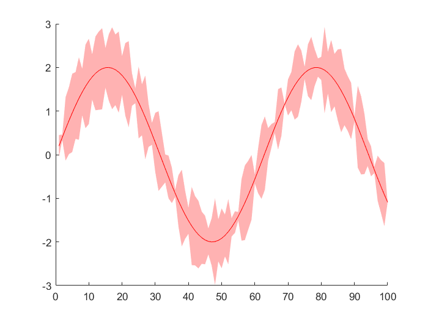

# Shaded Plot: a function for data shaded drawing

  

`shadedplot(x, y, attri)` 是一个专门用于绘制带范围曲线的函数，范围可用于表现与预估值的偏离。
- `x` ：1×N 向量，作为x 轴坐标。
- `y` ：2×N 或 3×N 矩阵，前两行表示预估值偏离，第三行（如果有）表示预估值，作为y 轴数据。当大小为 2×N ，函数仅绘制偏离范围；当大小为 3×N ，函数还会绘制预估值。
- `attri` ：字符串，作为控制字符。操控绘制点格式、颜色、线条类型。

例. 
```matlab
x = 1:100
ran = rand(1,100);
y = [2*sin(.1*x)-ran;2*sin(.1*x)+ran;2*sin(.1*x)];
shadedplot(x,y,'r')
```

得到图像类似如下，

